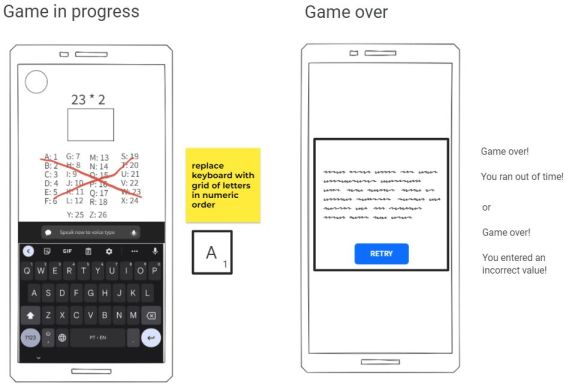
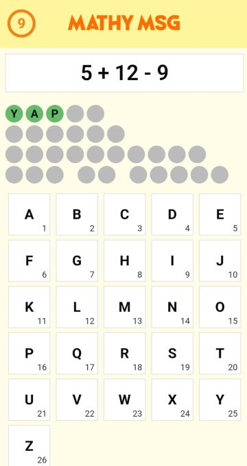

!!!
Note: Spent around an average of 2 hours each day unless otherwise stated
!!!

## Day 1 - 2022/02/05

### Brainstorming
- Simple web app intended for mobile screens
- Solve a bunch of math questions which spells out a message at the end
- 10 seconds timer to slightly increase difficulty
- Each letter has several different questions so each replay will not have the same sequence of questions

### Wireframing
- Used Google Jamboard and copied few assets from MockFlow

### Setting up codebase
- Created a new Github repo
- Set up Angular 13 codebase and deployed to Github Pages

## Day 2 - 2022/02/06
- Was looking for Bootstrap alternatives and settled on Foundation
- Landing page, placeholder game page and tile component

## Day 3 - 2022/02/07
- Game over page, set up tiles as "keyboard" for answers
- Add countdown with a circle animation (<a href="https://codepen.io/charlenopires/pen/JMoxdb" target="_blank">credit</a>)
- Game over page message depends on whether it was due to wrong answer or running out of time

## Day 4 - 2022/02/08
- Problem: I was not able to figure out how to reset the circle animation whenever the timer needs to be resetted
- Ended up removing the animation in favour of completing the MVP ASAP
- Read the math questions from YAML file (thanks Kartik)
- Dot UIs to show letters answered so far (not in wireframe)
- The order of letters for the words are randomized each time to avoid just memorizing the previous letters (<a href="https://stackoverflow.com/a/2450976" target="_blank">shuffle algorithm credit</a>)

